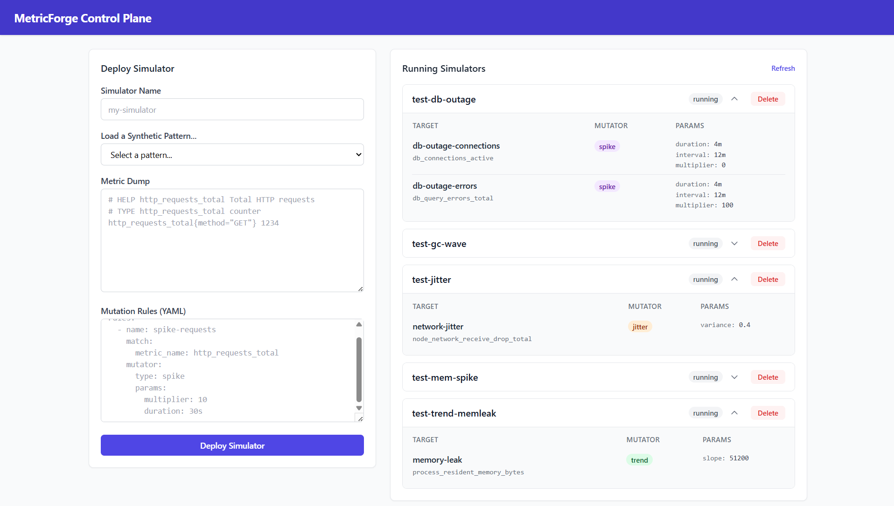
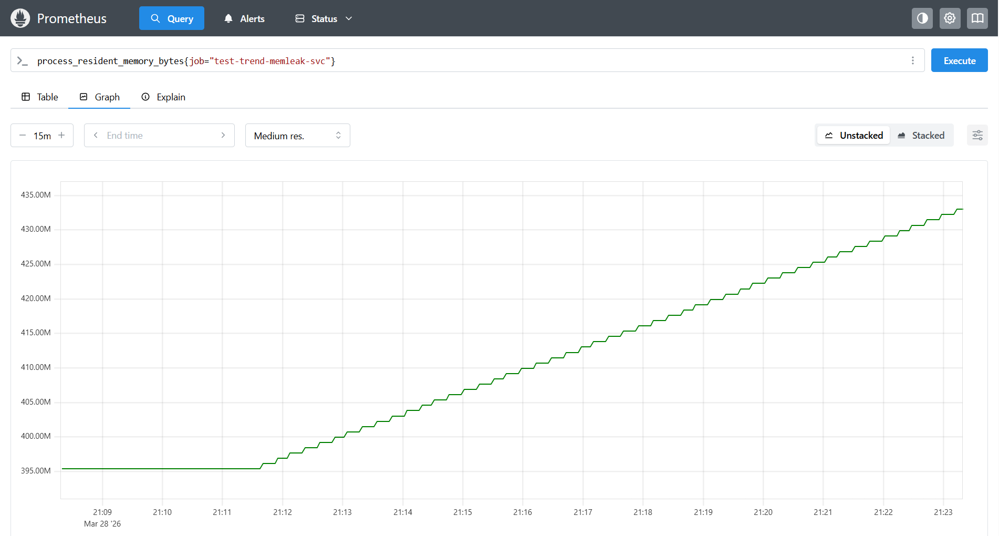

# FaultLine

**Inject realistic failure patterns into Prometheus metrics — without touching production.**

FaultLine dynamically simulates Prometheus exporters based on static metric dumps. You define mutation rules (spikes, trends, waves, jitter, outages) and FaultLine serves a live `/metrics` endpoint that Prometheus can scrape, letting you test alerting rules and dashboards against controlled, reproducible failure scenarios.

---

## Table of Contents

- [Overview](#overview)
- [Screenshots](#screenshots)
- [Architecture](#architecture)
- [Build & Test](#build--test)
- [Kubernetes Deployment](#kubernetes-deployment)
- [Creating a Simulator](#creating-a-simulator)
- [Mutation Rule Reference](#mutation-rule-reference)
- [Synthetic Pattern Library](#synthetic-pattern-library)
- [Development](#development)

---

## Overview

FaultLine has three components:

| Component | Description |
|-----------|-------------|
| **Controller** | Go REST API that manages simulator lifecycle via the Kubernetes API |
| **Simulator** | Go worker that parses a Prometheus text dump, applies mutation rules, and serves `/metrics` |
| **UI** | React dashboard for deploying simulators and browsing the built-in pattern library |

Each simulator runs as a Kubernetes Deployment. The controller creates the Deployment, a ConfigMap (holding the metric dump and rules), and a Service — all scoped to the `faultline` namespace.

---

## Screenshots





---

## Architecture

```
                    ┌──────────────────────────────────────────────────────┐
                    │                  Kubernetes Cluster                  │
                    │                                                      │
  Browser ──────► UI (React/Nginx) ──► Controller (Go API) ──► K8s API   │
                                                          │                │
                                                          ▼                │
                                              Simulator Pods               │
                                              └─ /metrics endpoint         │
                                                                           │
  Prometheus ◄───────────────────────────── scrapes /metrics              │
                                                                           │
                    └──────────────────────────────────────────────────────┘
```

The Controller uses a Kubernetes ServiceAccount with RBAC permissions to create and delete ConfigMaps, Deployments, and Services on behalf of the user.

---

## Build & Test

### Prerequisites

- Go 1.22+
- Node.js 22+ (with npm)
- Docker
- `kubectl` + `kustomize` (for Kubernetes deployment)

### Go

```bash
# Run all tests
go test ./... -v

# Build the controller binary
go build -o bin/controller ./cmd/controller

# Build the simulator binary
go build -o bin/simulator ./cmd/simulator
```

### UI

```bash
cd ui
npm install
npm run dev      # Development server at http://localhost:5173
npm run build    # Production build to ui/dist/
```

### Docker Images

```bash
# Build all three images
docker build -f Dockerfile.controller -t faultline-controller:latest .
docker build -f Dockerfile.simulator  -t faultline-simulator:latest  .
docker build -f Dockerfile.ui         -t faultline-ui:latest         .
```

All images run as a non-root user. The controller and simulator expose port `8080`; the UI serves on port `80` via nginx.

---

## Kubernetes Deployment

### 1. Apply the manifests

```bash
kubectl apply -k k8s/controller/
```

This creates the following resources in the `faultline` namespace:

| Resource | Name | Purpose |
|----------|------|---------|
| ServiceAccount | `faultline-controller` | Identity for the controller pod |
| Role + RoleBinding | `faultline-controller` | RBAC: ConfigMaps, Deployments, Services |
| Deployment | `faultline-controller` | Controller API server |
| Deployment | `faultline-ui` | React dashboard |
| Service | `faultline-controller` | ClusterIP, port 80 → 8080 |
| Service | `faultline-ui` | ClusterIP, port 80 |
| ServiceMonitor | `faultline` | Prometheus scrape config (requires Prometheus Operator) |

### 2. Access the UI

```bash
kubectl -n faultline port-forward svc/faultline-ui 8080:80
# Open http://localhost:8080
```

### 3. Configure Prometheus scraping

If you are using the **Prometheus Operator**, the `ServiceMonitor` resource is applied automatically. Each simulator Service is labelled `app=faultline-worker` and the monitor targets that selector.

Without the Operator, add a scrape job to your `prometheus.yml`:

```yaml
scrape_configs:
  - job_name: faultline
    kubernetes_sd_configs:
      - role: service
        namespaces:
          names: [faultline]
    relabel_configs:
      - source_labels: [__meta_kubernetes_service_label_app]
        regex: faultline-worker
        action: keep
```

---

## Creating a Simulator

### Via the UI

1. Open the dashboard.
2. Enter a **simulator name** (must be a valid Kubernetes name).
3. Select a pattern from the **Synthetic Metric Pattern Library** dropdown, or paste your own Prometheus text-format dump and YAML rules.
4. Click **Deploy Simulator**.

The simulator appears in the running list on the right. Expand it to see active rules.

### Via the API

```bash
curl -X POST http://<controller-host>/api/simulators \
  -H "Content-Type: application/json" \
  -d '{
    "name": "my-sim",
    "dump_payload": "# HELP http_requests_total ...\nhttp_requests_total{status=\"200\"} 1000",
    "rules_payload": "rules:\n  - name: my-rule\n    match:\n      metric_name: http_requests_total\n    mutator:\n      type: spike\n      params:\n        multiplier: 10\n        duration: 30s\n        interval: 2m"
  }'

# List running simulators
curl http://<controller-host>/api/simulators

# Delete a simulator
curl -X DELETE http://<controller-host>/api/simulators/my-sim
```

### Rules YAML format

```yaml
rules:
  - name: <rule-name>           # arbitrary, used for logging
    match:
      metric_name: <name>       # exact metric name; omit to match all metrics
      labels:                   # optional; ALL listed labels must match (AND semantics)
        <label-key>: <value>
    mutator:
      type: <spike|trend|wave|jitter|outage>
      params:
        # mutator-specific params (see reference below)
        # schedule params (optional):
        initial_delay: 10s      # wait before first activation
        duration: 30s           # how long the rule stays active per window
        interval: 2m            # time between activations (omit for always-active)
        interval_jitter: 15s    # random variance added to interval
```

Duration values are Go duration strings: `"500ms"`, `"30s"`, `"5m"`, `"1h"`.

---

## Mutation Rule Reference

### Mutator types

| Type | Parameter | Type | Description |
|------|-----------|------|-------------|
| `spike` | `multiplier` | float | Multiply the metric value by N during the active window. Use `0` to simulate an outage. |
| `trend` | `slope` | float | Add `slope × elapsed_seconds` to the value. Negative slope = decreasing metric. Resets each activation window. |
| `wave` | `amplitude` | float | Oscillation amplitude as a fraction of the base value (e.g. `0.5` = ±50%). |
|       | `frequency` | float | Oscillation frequency in Hz. `0.0167` ≈ 1 cycle/minute. `0.0000231` ≈ 1 cycle/12h. |
| `jitter` | `variance` | float | Random noise as a fraction of the current value (e.g. `0.05` = ±5%). Applied every scrape. |
| `outage` | `action` | string | Currently supports `"drop_to_zero"`. Forces the metric to 0. |

### Schedule fields

All schedule fields live inside `mutator.params`. All are optional.

| Field | Type | Description |
|-------|------|-------------|
| `initial_delay` | duration | Pause before the first activation window. |
| `duration` | duration | Length of each active window. Omit for always-on. |
| `interval` | duration | Gap between the end of one window and the start of the next. |
| `interval_jitter` | duration | Uniform random value added to each interval (prevents thundering herds). |

---

## Synthetic Pattern Library

21 pre-built patterns are available in the UI dropdown and in `ui/src/data/syntheticPatterns.ts`.

### Spikes (Sudden Surges)

| ID | Name | What it simulates |
|----|------|-------------------|
| `spike-traffic` | Viral Traffic Surge | HTTP GET requests ×25 for 45 s every ~3 m |
| `spike-memory` | Memory Pressure Spike | RSS memory ×8 for 30 s every 2 m |
| `spike-errors` | Error Rate Explosion | HTTP 500 responses ×50 for 20 s every ~90 s |
| `spike-latency` | Database Latency Spike | DB query duration sum ×30 for 15 s every ~2 m |

### Trends (Gradual Degradation)

| ID | Name | What it simulates |
|----|------|-------------------|
| `trend-memory-leak` | Memory Leak | RSS grows +50 KB/s continuously |
| `trend-memory-leak-periodic` | Memory Leak with Periodic Recovery | RSS grows +50 KB/s for 5 m, recovers, repeats every 55 m |
| `trend-disk-fill` | Disk Filling Up | Available bytes shrink at −1 MB/s |
| `trend-connection-pool` | Connection Pool Exhaustion | Active DB connections grow +0.5/s |
| `trend-error-rate` | Slowly Rising Error Rate | HTTP 500 count grows +2/s |

### Jitter (Instability & Noise)

| ID | Name | What it simulates |
|----|------|-------------------|
| `jitter-network` | Network Packet Loss Noise | Network drop counter ±40% noise |
| `jitter-cpu` | Unstable CPU Usage | CPU user-mode counter ±30% noise |
| `jitter-response-time` | Erratic Response Times | HTTP response time gauge ±60% noise |
| `jitter-queue` | Flapping Queue Depth | Job queue depth ±80% noise |

### Outages (Complete Failures)

| ID | Name | What it simulates |
|----|------|-------------------|
| `outage-service-down` | Service Complete Outage | `up` gauge → 0 for 5 m every 10 m |
| `outage-zero-traffic` | Zero Incoming Traffic | HTTP request counter → 0 for 3 m every ~8 m |
| `outage-db-connection` | Database Connection Loss | Active connections → 0, errors ×100 for 4 m every 12 m |
| `outage-partial-degradation` | Partial Region Failure | `eu-west` traffic → 0 and 503s ×200 for 6 m every 15 m |

### Waves (Cyclical Patterns)

| ID | Name | What it simulates |
|----|------|-------------------|
| `wave-business-hours` | Business Hours Traffic | 12-hour sinusoidal traffic cycle (±70%) |
| `wave-heartbeat` | Heartbeat / Health Check | Probe success oscillates at 1-minute period (±10%) |
| `wave-gc-pressure` | Periodic GC Pressure | GC duration sum oscillates at 20-second period (±50%) |
| `wave-batch-job` | Scheduled Batch Job Load | Worker CPU oscillates at 6-minute batch cycle (±80%) |

---

## Development

### Project layout

```
FaultLine/
├── cmd/
│   ├── controller/        # Controller entrypoint (main.go)
│   └── simulator/         # Simulator entrypoint (main.go)
├── pkg/
│   ├── api/               # REST handler + router
│   ├── config/            # YAML config loader & rule factory
│   ├── k8s/               # Kubernetes client wrapper
│   ├── mutator/           # Mutation engine (mutators, scheduling, rules)
│   ├── parser/            # Prometheus text-format parser
│   └── server/            # HTTP server & metrics formatter
├── ui/                    # React/Vite/Tailwind frontend
│   └── src/
│       ├── api/           # Fetch-based API client
│       ├── components/    # CreateForm, SimulatorList
│       └── data/          # syntheticPatterns.ts
├── k8s/controller/        # Kustomize manifests
├── docs/
│   └── screenshots/       # Place UI/Prometheus screenshots here
├── Dockerfile.controller
├── Dockerfile.simulator
└── Dockerfile.ui
```

### Running the UI dev server

The UI makes API calls to `/api/...`. In development, proxy them to the controller:

```typescript
// ui/vite.config.ts — add a server.proxy entry
server: {
  proxy: {
    '/api': 'http://localhost:8080'
  }
}
```

Then start the controller locally and run `npm run dev` in `ui/`.

### Testing

```bash
go test ./... -v          # all packages with verbose output
go test ./pkg/mutator/... # single package
```

Tests follow the table-driven pattern. Key state-seeding helpers:

```go
// Put a spike rule in its active window
state.ActiveUntil = time.Now().Add(time.Hour)

// Simulate elapsed time for a trend rule
state.ActiveSince = now.Add(-elapsed)
```
